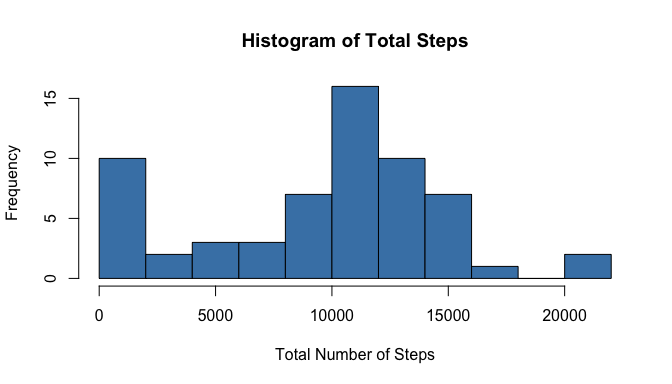
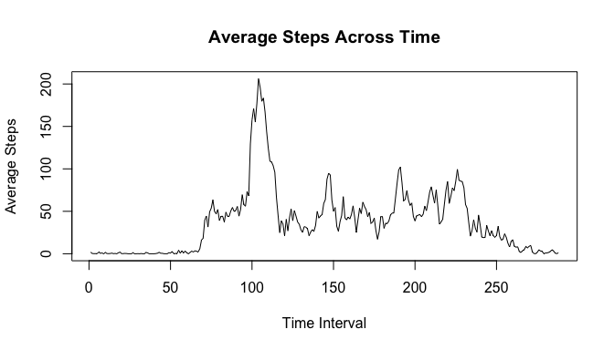
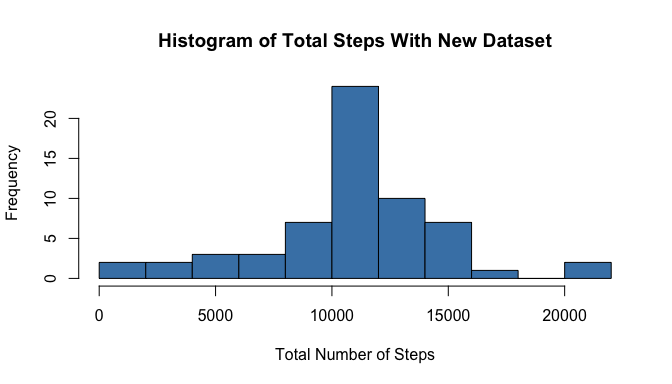
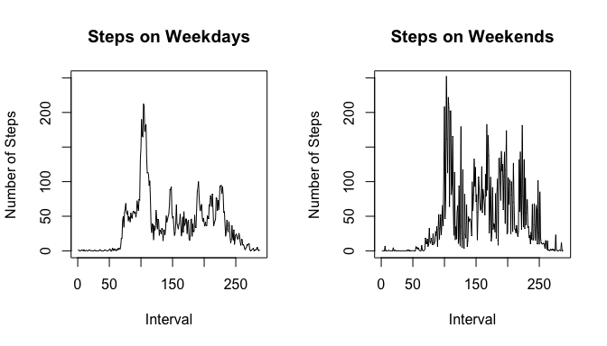

# Course Project 1

#Load Required Packages


```r
library(dplyr)
```

```
## 
## Attaching package: 'dplyr'
```

```
## The following objects are masked from 'package:stats':
## 
##     filter, lag
```

```
## The following objects are masked from 'package:base':
## 
##     intersect, setdiff, setequal, union
```

#Download and Load Data


```r
url1 = "https://d396qusza40orc.cloudfront.net/repdata%2Fdata%2Factivity.zip"
if(!file.exists("activity.zip")) {download.file(url1, destfile = "activity.zip")}
unzip("activity.zip")
activity <- read.csv("activity.csv")
```

#Histogram of Total Steps


```r
#calculate total number of steps
total.steps <- data.frame(with(activity, tapply(steps, date, sum, na.rm = T)))
colnames(total.steps) <- c("Sum")
#plot histogram
hist(total.steps$Sum, breaks = 10, xlab = "Total Number of Steps",
     main = "Histogram of Total Steps", col = "steelblue")
```

<!-- -->

#Mean and Median of Steps


```r
#mean number of steps
mean.s <- activity %>%
  group_by(as.factor(date)) %>%
  summarise(mean.step = mean(steps, na.rm = T))
print(mean.s)
```

```
## # A tibble: 61 x 2
##    `as.factor(date)` mean.step
##               <fctr>     <dbl>
## 1         2012-10-01       NaN
## 2         2012-10-02   0.43750
## 3         2012-10-03  39.41667
## 4         2012-10-04  42.06944
## 5         2012-10-05  46.15972
## 6         2012-10-06  53.54167
## 7         2012-10-07  38.24653
## 8         2012-10-08       NaN
## 9         2012-10-09  44.48264
## 10        2012-10-10  34.37500
## # ... with 51 more rows
```

```r
#median number of steps
median.s <- activity %>%
  group_by(as.factor(date)) %>%
  summarise(median.step = median(steps, na.rm = T))
print(median.s)
```

```
## # A tibble: 61 x 2
##    `as.factor(date)` median.step
##               <fctr>       <dbl>
## 1         2012-10-01          NA
## 2         2012-10-02           0
## 3         2012-10-03           0
## 4         2012-10-04           0
## 5         2012-10-05           0
## 6         2012-10-06           0
## 7         2012-10-07           0
## 8         2012-10-08          NA
## 9         2012-10-09           0
## 10        2012-10-10           0
## # ... with 51 more rows
```

#Time-Series Plot of Average Steps


```r
#average steps across different intervals
mean.s.daily <- data.frame(with(activity, tapply(steps, interval, mean, 
                                                 na.rm = T)))
plot(mean.s.daily, type = "l", xlab = "Time Interval", ylab = "Average Steps",
     main = "Average Steps Across Time")
```

<!-- -->

#Interval With the Most Steps


```r
colnames(mean.s.daily) <- make.names("mean.steps.daily")
#sort of maximum steps
max.steps <- mean.s.daily[which.max(mean.s.daily$mean.steps.daily), ]
```

The maximum number of steps was at 206.1698113 with interval 835.

#Total Rows With NAs


```r
#sum number of NAs
na.rows <- sum(!complete.cases(activity))
```

The total number of NAs in the data was 2304.

#Replace NAs With Mean Values In New Dataset


```r
#create new dataset
n.activity <- activity
#replace NAs by mean values
n.activity$steps <- with(n.activity, 
                       ifelse(is.na(steps), 
                              ave(steps, interval, 
                                  FUN = function(x) mean(x, na.rm = T)), 
                              steps))
```

#Histogram of New Dataset


```r
#calculate total number of steps
total.steps.n <- data.frame(with(n.activity, tapply(steps, date, sum, 
                                                  na.rm = T)))
colnames(total.steps.n) <- c("Sum")
#plot histogram
hist(total.steps.n$Sum, breaks = 10, xlab = "Total Number of Steps",
     main = "Histogram of Total Steps With New Dataset", col = "steelblue")
```

<!-- -->

The histogram looks more unimodal now with most of the total steps being around 10000.

#Mean and Median Steps of New Dataset


```r
#mean number of steps
mean.s.n <- n.activity %>%
  group_by(as.factor(date)) %>%
  summarise(mean.step = mean(steps, na.rm = T))
print(mean.s.n)
```

```
## # A tibble: 61 x 2
##    `as.factor(date)` mean.step
##               <fctr>     <dbl>
## 1         2012-10-01  37.38260
## 2         2012-10-02   0.43750
## 3         2012-10-03  39.41667
## 4         2012-10-04  42.06944
## 5         2012-10-05  46.15972
## 6         2012-10-06  53.54167
## 7         2012-10-07  38.24653
## 8         2012-10-08  37.38260
## 9         2012-10-09  44.48264
## 10        2012-10-10  34.37500
## # ... with 51 more rows
```

```r
#median number of steps
median.s.n <- n.activity %>%
  group_by(as.factor(date)) %>%
  summarise(median.step = median(steps, na.rm = T))
print(median.s.n)
```

```
## # A tibble: 61 x 2
##    `as.factor(date)` median.step
##               <fctr>       <dbl>
## 1         2012-10-01    34.11321
## 2         2012-10-02     0.00000
## 3         2012-10-03     0.00000
## 4         2012-10-04     0.00000
## 5         2012-10-05     0.00000
## 6         2012-10-06     0.00000
## 7         2012-10-07     0.00000
## 8         2012-10-08    34.11321
## 9         2012-10-09     0.00000
## 10        2012-10-10     0.00000
## # ... with 51 more rows
```

The beginning values of mean steps is now a number, instead of being not a number (NaN). The median number of steps begin to have values other than just zero. NAs seems to affect this dataset a lot by skewing the dataset.

#Create Factor Variables of Weekdays and Weekends


```r
#convert date to date format
n.activity$date <- as.POSIXct(strptime(n.activity$date, "%Y-%m-%d"))
#create factor variable for weekday and weekend
n.activity$wd <- ifelse(weekdays(n.activity$date, abbreviate = T) ==
                          c("Fri", "Sat", "Sun"), "weekend", "weekday")
```

#Plot Average Steps for Weekday and Weekend


```r
n.split <- (split(n.activity, n.activity$wd))
mean.weekday <- tapply((n.split$weekday)$steps, (n.split$weekday)$interval,
                       mean)
mean.weekend <- tapply((n.split$weekend)$steps, (n.split$weekend)$interval,
                       mean)
par(mfrow = c(1, 2))
plot(mean.weekday, type = "l", ylab = "Number of Steps",
     xlab = "Interval", main = "Steps on Weekdays", ylim = c(0, 250))
plot(mean.weekend, type = "l", ylab = "Number of Steps",
     xlab = "Interval", main = "Steps on Weekends", ylim = c(0, 250))
```

<!-- -->
